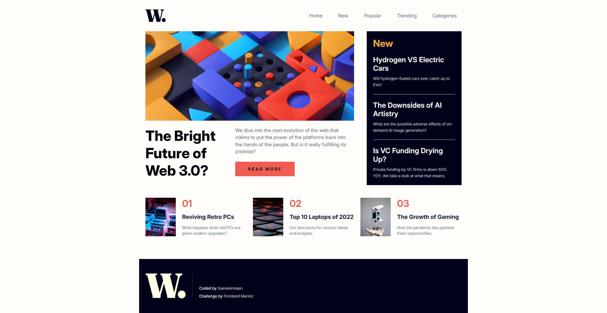

# Frontend Mentor - News homepage solution

This is a solution to the [News homepage challenge on Frontend Mentor](https://www.frontendmentor.io/challenges/news-homepage-H6SWTa1MFl). Frontend Mentor challenges help you improve your coding skills by building realistic projects.

## Table of contents

- [The challenge](#the-challenge)
- [Screenshot](#screenshot)
- [Links](#links)
  - [Built with](#built-with)
  - [What I learned](#what-i-learned)
  - [Useful resources](#useful-resources)
- [Author](#author)

### The challenge

Users should be able to:

- View the optimal layout for the interface depending on their device's screen size
- See hover and focus states for all interactive elements on the page

### Screenshot

### Links

- Solution URL: [Solution](https://github.com/SaeneArmaan/News-Homepage-Main)
- Live Site URL: [Add live site URL here](https://your-live-site-url.com)

### Built with

- Semantic HTML5 markup
- CSS custom properties
- Flexbox
- Mobile-first workflow

### What I learned

I have learned that we can use picture tag in HTML for more responsive image handling by providing multiple image sources based on different conditions, such as screen size or device pixel ratio. Inside the picture tag, we can use multiple source tags to define various image files and media queries and the browser will choose the most suitable image based on the provided conditions and we can also have a img tag which we can use as a fallback, so it always ensures that an image is displayed, even if none of the conditions in the source tags are met.

### Useful resources

- [MDN Docs](https://developer.mozilla.org/en-US/) - This helped me with making my images responsive using picture tag

## Author

- Frontend Mentor - [@SaeneArmaan](https://www.frontendmentor.io/profile/SaeneArmaan)
- Twitter - [@Armaan2Saini](https://x.com/Armaan2Saini)
